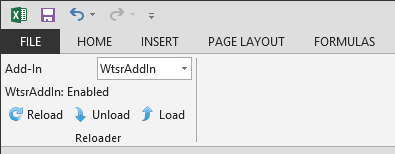

# AddInReloader

A tiny little Excel COM add-in which reloads other Excel COM add-ins. For VSTO development.

## The old way

If you're developing an Excel add-in in Visual Studio with VSTO, currently you have to:

 * Build latest version in VS
 * Switch to Excel
 * :fire: Go to Developer, COM Add-Ins
 * :fire: **Untick** your add-in, click OK
 * :fire: Reopen COM Add-Ins
 * :fire: **Tick** your add-in, click OK

## The new way

With AddInReloader, this changes to:

 * Build latest version in VS
 * Switch to Excel
 * :white_check_mark: Go to Add-Ins, select your Add-In from the dropdown
 * :white_check_mark: Click Reload
 

## Other features

There are also separate Unload and Load buttons for when you can't Build due to Office holding an active reference to your Add-In. AddInReloader tells you the current status of the currently selected Add-In.

## Setup

Download and build in VS 2010.

This will make it available to your Excel instance, but funnily enough, you have to manually reload the Add-In on first time use; follow the procedure from "The old way" above.

## Credits

Icons by [Yusuke Kamiyamane](http://p.yusukekamiyamane.com/). Licensed under a Creative Commons Attribution 3.0 License.

## License

See [LICENSE](./LICENSE.txt)